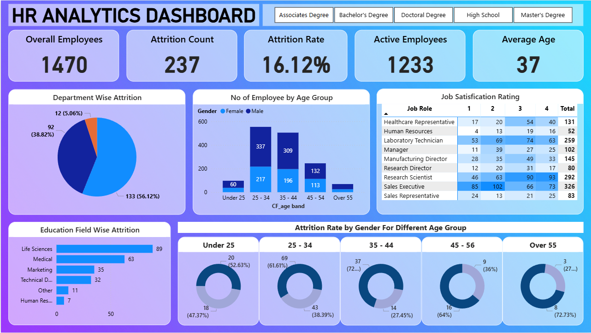

# HR-Analytics-Dashboard

# HR Analytics Dashboard 👥

## Project Overview
This repository features a comprehensive HR Analytics Dashboard designed to monitor employee attrition, track demographic distributions, and assess overall workforce satisfaction. The dashboard translates complex human resources data into a visual format, helping leadership teams and HR professionals identify retention trends and make data-driven decisions to improve workplace engagement.

## Key Performance Indicators (KPIs)
At a glance, the dashboard provides a high-level snapshot of workforce health through the following core metrics:
*   **Overall Employees:** 1470
*   **Attrition Count:** 237
*   **Attrition Rate:** 16.12%
*   **Active Employees:** 1233
*   **Average Age:** 37

## Key Insights & Visualizations
The dashboard is structurally divided to uncover the driving factors behind employee turnover and demographic makeup:

*   **Department Wise Attrition:** A pie chart highlighting the distribution of the 237 departed employees across core company departments, showing a significant concentration in one primary sector (56.12%).
*   **No. of Employees by Age Group:** A stacked bar chart segmenting the workforce by age brackets and gender (Male/Female). It reveals that the bulk of the workforce falls within the 25–34 and 35–44 age bands.
*   **Job Satisfaction Rating:** A detailed matrix analyzing satisfaction scores (rated 1 to 4) across distinct job roles (e.g., Sales Executive, Research Scientist, Laboratory Technician). 
*   **Education Field Wise Attrition:** A horizontal bar chart identifying turnover volumes based on academic background, indicating that employees from 'Life Sciences' (89) and 'Medical' (63) fields experience the highest attrition.
*   **Attrition Rate by Gender For Different Age Groups:** A series of donut charts offering a granular, side-by-side comparison of male vs. female turnover rates within specific age demographics.

## Interactive Features
*   **Dynamic Education Filters:** The top navigation bar features built-in slicers, allowing users to dynamically filter the entire dashboard based on educational attainment: 
    *   Associates Degree
    *   Bachelor's Degree
    *   Doctoral Degree
    *   High School
    *   Master's Degree

## How to Use
1.  Clone this repository to your local machine.
2.  Open the dashboard source file in your Business Intelligence tool (e.g., Power BI, Tableau, Excel).
3.  Ensure your underlying HR dataset is properly linked.
4.  Utilize the education degree filters at the top of the dashboard to drill down into specific employee segments.
